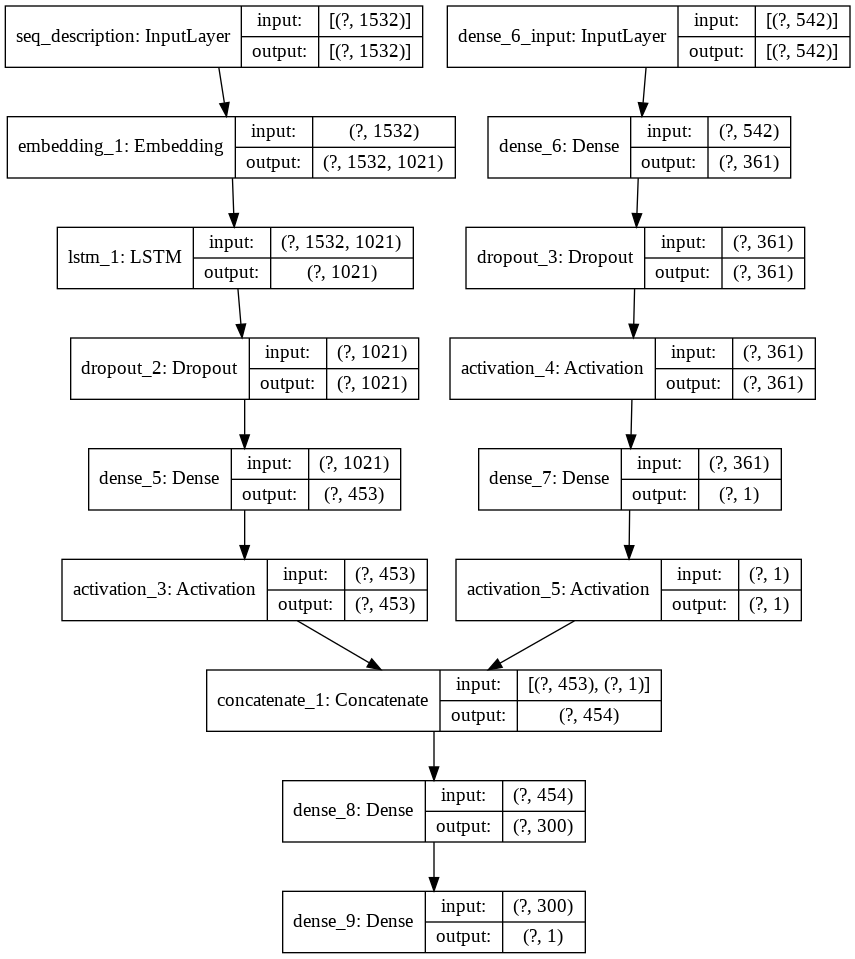

# Проект №6. Выбираем авто выгодно (ML и DL)

# Задача

Предсказать стоимость автомобиля по его характеристикам, текстовому описанию или картинке. 

**О данных**

В этот раз данные, с которыми необходимо работать, предоставлены.

# Этапы работы

## Подготовка данных

Предоставленные данные довольно чистые. Чистка была проведене в нескольких признаках. Признак `name` был обработан, для того, чтобы достать полезную информацию. В процессе подготовки было добавлено несколько новых признаков.

Тренировочные данные ([train.csv](https://drive.google.com/file/d/1CgUxQlOUFZ7J60Hnxoe7fTlFRz8NgDn6/view?usp=sharing)) и тестовые данные ([test](https://drive.google.com/file/d/10t7GPHwaHqK1bf0Zu4I2wZHK_47afL0c/view?usp=sharing)) обрабатывались паралельно. После обработки получил два датасета:

- [clear_train.csv](https://drive.google.com/file/d/1-3kiZxEddvuNFoRTfMA6cA8bu7LjP2b3/view?usp=sharing)
- [clear_test.csv](https://drive.google.com/file/d/1-0yG59TcpJoDSeOclid1z-nc1Fh3yud2/view?usp=sharing)

Ноутбук с обработкой данных (лежит в папке `eda`):

- `car_train_test_eda.ipynb`

# Построение моделей

## CatBoost

Ноутбук с моделью (папка `model`):

- `cat_boost_model.ipynb`

При построении модели были подобраны оптимальные параметры с помощью метода grid_search() и ручного перебора.

## Simple neural network

Ноутбук с моделью (папка `model`):

- `dense_model.ipynb`

При построении модели, опытным путем были выявлены наилучшие параметры, а так же взяты логорифмы от некоторых признаков, что в сумме помогло улучшить score. При загрузке результатов на kaggle модель показала лучше резльтат, чем **CatBoost**.

## NLP + table

Ноутбук с моделью (папка `model`):

- `multi_input_nlp.ipynb`

Для построения модели на основе текста и табличных данных необходимо было подготовить текст. Для этого был выбран один из способов обработки текста, а именно bag of words с последующей обработкой с помощью tfidf.

Нейронная сеть:

