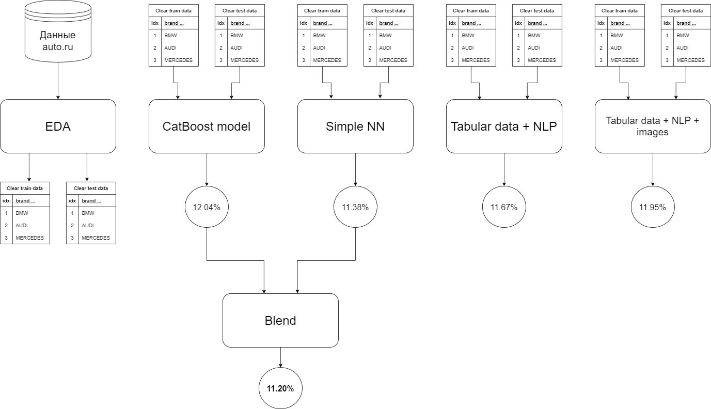
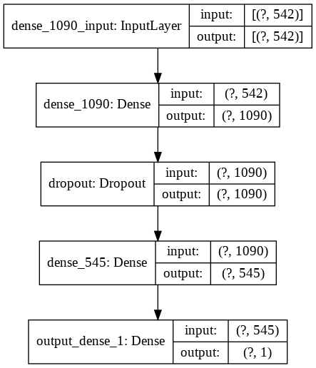

# Задача

Предсказать стоимость автомобиля по его характеристикам, текстовому описанию или картинке. 

**О данных**

В этот раз данные, с которыми необходимо работать, предоставлены.

# Этапы работы

## Road map

## Подготовка данных

Предоставленные данные довольно чистые. Чистка была проведене в нескольких признаках. Признак `name` был обработан, для того, чтобы достать полезную информацию. В процессе подготовки было добавлено несколько новых признаков.

Тренировочные данные ([train.csv](https://drive.google.com/file/d/1CgUxQlOUFZ7J60Hnxoe7fTlFRz8NgDn6/view?usp=sharing)) и тестовые данные ([test](https://drive.google.com/file/d/10t7GPHwaHqK1bf0Zu4I2wZHK_47afL0c/view?usp=sharing)) обрабатывались паралельно. После обработки получил два датасета:

- [clear_train.csv](https://drive.google.com/file/d/1-3kiZxEddvuNFoRTfMA6cA8bu7LjP2b3/view?usp=sharing)
- [clear_test.csv](https://drive.google.com/file/d/1-0yG59TcpJoDSeOclid1z-nc1Fh3yud2/view?usp=sharing)

Ноутбук с обработкой данных (лежит в папке `eda`):

- `car_train_test_eda.ipynb`

# Построение моделей

## CatBoost

Ноутбук с моделью (папка `model`):

- `cat_boost_model.ipynb`

При построении модели были подобраны оптимальные параметры с помощью метода grid_search() и ручного перебора. С помощью кросс валидации удалость улушить результат.

## Simple neural network

Ноутбук с моделью (папка `model`):

- `dense_model.ipynb`

Нейронная сеть:

При построении модели, опытным путем были выявлены наилучшие параметры, а так же взяты логорифмы некоторых признаков, что в сумме помогло улучшить score. При загрузке результатов на kaggle модель показала лучше резльтат, чем **CatBoost**. Так же удалось улучшить результат с помощью кросс валидации.

## tabular data + NLP

Ноутбук с моделью (папка `model`):

- `multi_input_nlp.ipynb`

Для построения модели на основе текста и табличных данных необходимо было подготовить текст. Для этого был выбран один из способов обработки текста, а именно bag of words с последующей обработкой с помощью tfidf. Перед этим использовал метод под названием **лемматезация** и избавился от **стоп-слов**. Опытным путем подбирал параметры для функции обработки текста, стараясь балансировать между качеством и скоростью скорость обучения модели. Так же написал функцию для определения оптимального числа нейронов в скрытых слоях.

Нейронная сеть:

В итоге модель показала результат немного хуже, чем простая нейронная сеть без текста. Кросс валидацию решил не использовать из-за слишкого долго времени обучения.

## tabular data + NLP + images

Ноутбук с моделью (папка `model`):

-`multi_input_nlp_image.ipynb`

Так как датасет не большой, то перед построением модели добавил аугментацию c помощью библиотеки **albumentations**. Разобрался с конвеирами TensorFlow (tf.data.Dataset), для оптимизации затрат памяти, при построении модели. Обновил функцию для подбора оптимального количества нейронов в скрытых слоях. Для обучения за основу была взята предобученая сеть **EfficientNet**. Основываясь на данных, полученных с ресурса [Papper with code](https://paperswithcode.com/sota/image-classification-on-imagenet) я решил взять версию **FixEfficientNet-B4**, так как она имеет меньшее количество параметров (что влияет на время обучения), чем другие версии этой сети и при этом показывает отличные результаты. Итоговый результат так же оказался чуть хужем чем у обычной нейронной сети. Кросс валидацию делать так же не стал из-за долго времени обучения.

## Blend

Ноутбук с моделью (папка `model`):

- `blend_model.ipynb`

Финальным этапом работы над проекта было объединение резуьтатов ML и DL моделей. Среди моделей на основе нейронных сетей была выбрана простая нейронная сеть без текста и изображений. В начале я объденил резльтаты без кросс валидации и это дало небольшое улучшение. После объединил резльтаты моделей, предварительно использовав кросс валидацию для одной и другой. В итоге это дало самый лучший результат.

# Итоги и выводы

При работе над проектом была проведена большая работа. Освноены и отработы следующие навыки:

1. Иследование, обработка и подготовка данных. Закреплены знания о библиотеках **pandas, numpy, matplotlib, seaborn, scipy**
2. Построение ML моделей. Закреплены знания о библиотеках **sklearn, CatBoost**
3. Построение нейронных сетей. Изучены и отработы методы и библиотеки для обработки текста (**nltk, pymystem3, Tokenizer, CountVectorizer, TfidfVectorizer, TfidfTransformer**) и изображений (**ImageDataAugmentor, albumentations**).

Работа выпонялась на площадке Google Colaboratory. Google предоставляет вычислительные мощности (CPU и GPU) для такого типа задач, что оказалось очень кстати при работе с текстом и изображениями. Алтернативным вариантом было использовать площадку kaggle, где так же предоставляются вычислительные мощности. И там и там есть ограничение по времени на использование GPU.

Из результатов работы можно сделать вывод, что данная задача хорошо решается с помощью машинного обучения и простых нейронных сетей, без изображений и текста. Возможно, при налачии большего количества времени удалось бы добиться лучшего результата.
